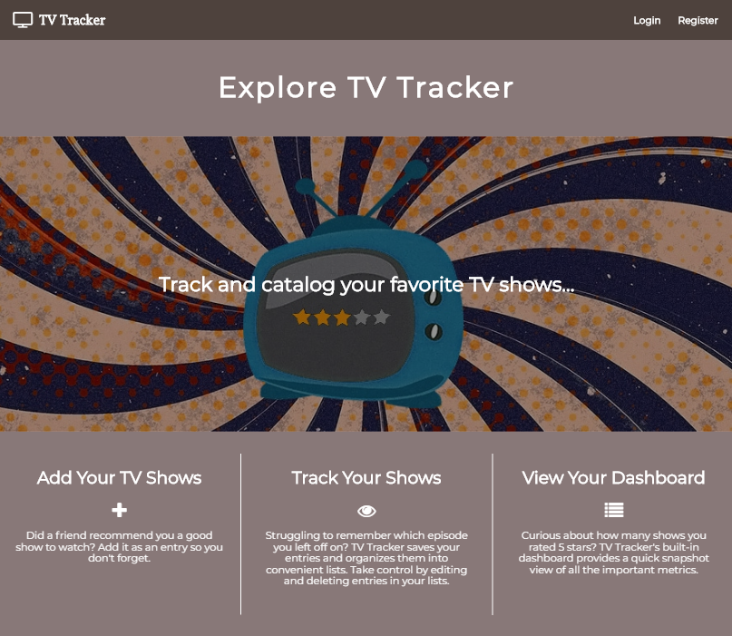
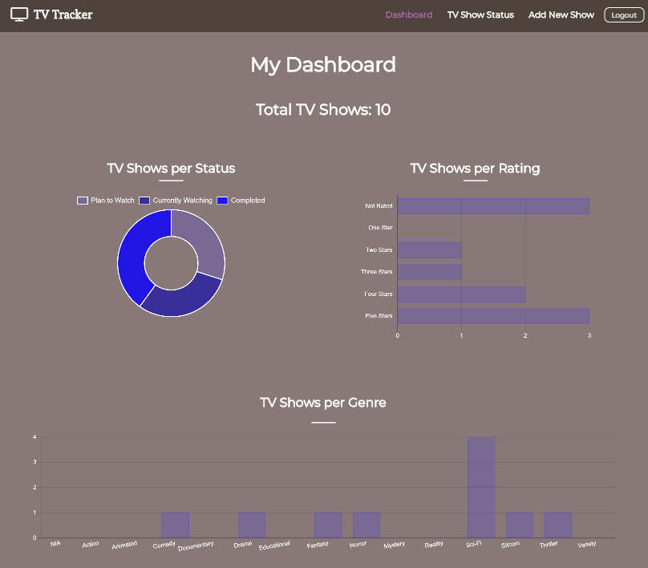
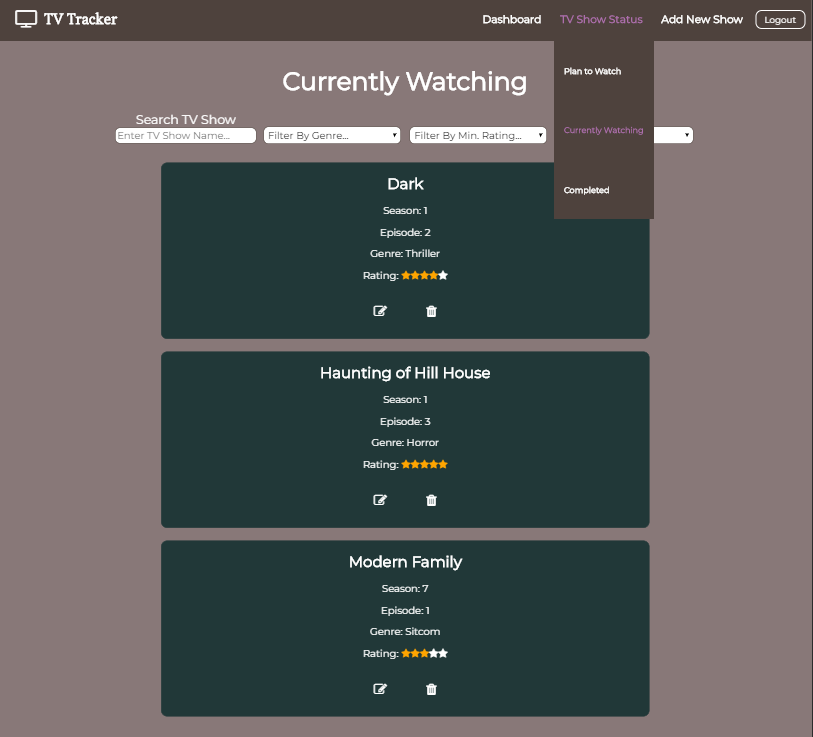
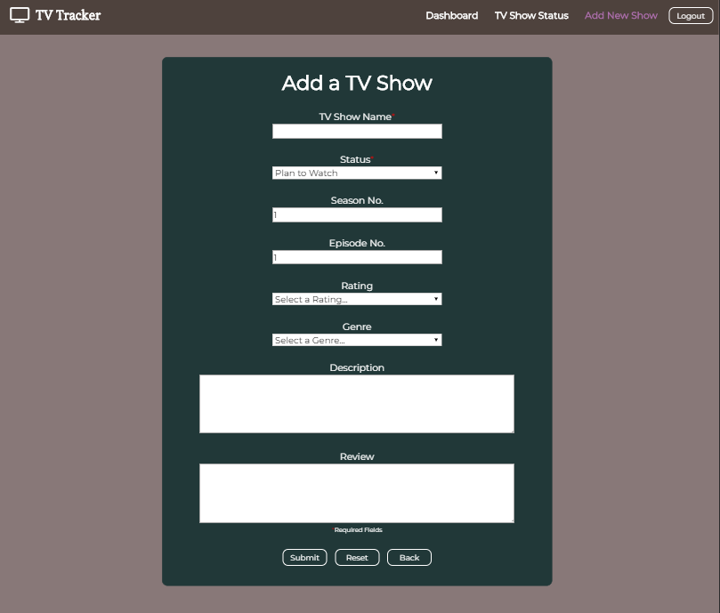
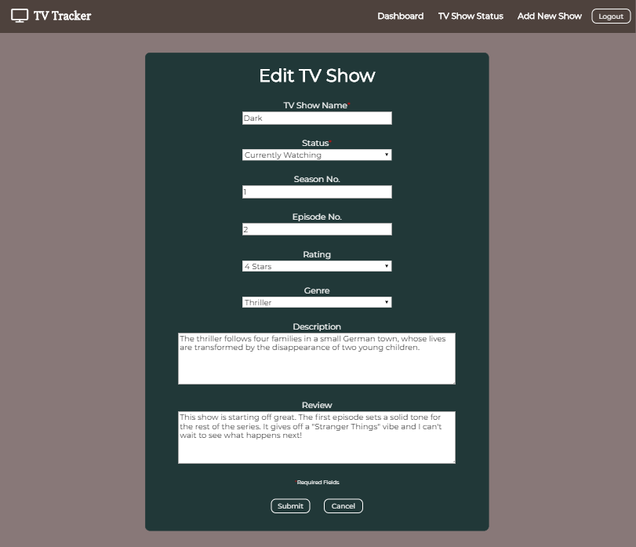

# TV Tracker

* Live version: https://tv-tracker-app.wbae912.now.sh/
  * Demo username: testuser
  * Demo password: Password1
 
* Link to API repository:
  * GitHub: https://github.com/wbae912/william-tv-tracker-server
  * Live link: https://whispering-brook-43228.herokuapp.com/api/shows/all
  
  
## Getting Started
* Clone the repositories and install dependencies using ```npm install```
* Start the development server using ```npm start```
* Run tests using Jest & Enzyme using ```npm test```
  
  
## Description
TV Tracker is a React application that provides users a convenient platform to track and categorize their shows. Users are able to submit TV show entries and categorize them into lists including, "Plan to Watch", "Currently Watching", and "Completed". Users can customize their entries by adding ratings, reviews, or descriptions. The built-in dashboard offers digestible high-level analytics regarding the users' TV show submissions.


## Screenshots
#### Landing Page


#### Dashboard


#### Lists


#### Add TV Show


#### Edit TV Show (Fields are pre-populated with user inputs)



## Technologies
* HTML5
* CSS3
* ReactJS
  * React-ChartJS-2
